# CNN vs MLP for Image Classification (PyTorch)

## TL;DR

* Compared MLP vs CNN architectures on CIFAR-10
* Achieved ~85%+ accuracy using CNN v3
* Built a modular PyTorch training pipeline with TensorBoard logging
* Demonstrated the effectiveness of CNNs in capturing spatial features in image data

This project is designed with a production-style modular architecture, enabling easy experimentation and scalability.

---

## Overview

This project compares Convolutional Neural Networks (CNNs) with a Multi-Layer Perceptron (MLP) for image classification on the CIFAR-10 dataset.

The goal is to demonstrate why CNNs outperform fully connected networks for image data, while building a clean and scalable deep learning pipeline.

---

## Problem Statement

Multi-Layer Perceptrons (MLPs) treat images as flattened vectors, ignoring spatial structure.

Convolutional Neural Networks (CNNs), on the other hand, preserve spatial relationships using convolution operations, making them more effective for image tasks.

This project evaluates:

* Performance differences
* Generalization ability
* Training stability
* Parameter efficiency

---

## Dataset

* CIFAR-10 (via torchvision)
* 60,000 RGB images

  * 50,000 training
  * 10,000 testing
* 10 classes
* Image size: 32 × 32

---

## Project Structure

```
cnn-image-classification/
└── image_classification_cnn/
    ├── models/        # Model architectures
    ├── datasets/      # Data loading
    ├── engine/        # Training & evaluation
    ├── utils/         # Helper functions
    ├── results/       # Plots and outputs
    ├── runs/          # TensorBoard logs
    ├── notebooks/     # Experiments
    ├── config.py
    ├── train.py
    └── main.py
```

---

## Repository Highlights

* Modular architecture (models, engine, utils separation)
* Config-driven experiments
* Reproducible training setup
* Clear separation of training and evaluation logic

---

## Models Implemented

### 1. MLP (Baseline)

**File:** `models/mlp.py`
**Parameters:** 1,707,274

Architecture:

* Flatten: (3, 32, 32) → 3072
* Linear: 3072 → 512 → ReLU
* Linear: 512 → 256 → ReLU
* Linear: 256 → 10

---

### 2. CNN v2

**File:** `models/cnn_v2.py`
**Parameters:** 1,070,986

Architecture:

* Conv2D(3 → 32, 3×3, padding=1) → (32, 32, 32)

* BatchNorm → ReLU

* MaxPool → (32, 16, 16)

* Conv2D(32 → 64, 3×3, padding=1) → (64, 16, 16)

* BatchNorm → ReLU

* MaxPool → (64, 8, 8)

* Flatten → 4096

* Linear → 256 → ReLU

* Linear → 10

---

### 3. CNN v3 (Best Model)

**File:** `models/cnn_v3.py`
**Parameters:** 666,730

Architecture:

* Conv2D(3 → 32) → BatchNorm → ReLU

* Conv2D(32 → 32) → ReLU

* MaxPool → (32, 16, 16)

* Conv2D(32 → 64) → BatchNorm → ReLU

* Conv2D(64 → 64) → ReLU

* MaxPool → (64, 8, 8)

* Conv2D(64 → 128) → ReLU

* MaxPool → (128, 4, 4)

* Flatten → 2048

* Linear → 256 → ReLU

* Dropout (0.5)

* Linear → 10

---

## Results

| Model  | Validation Accuracy |
| ------ | ------------------- |
| MLP    | ~60–65%             |
| CNN v1 | ~75–78%             |
| CNN v2 | ~82–84%             |
| CNN v3 | ~85%+               |

---

### CNN v3 (Best Model)

#### Accuracy Curve

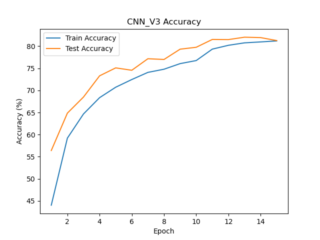

#### Loss Curve

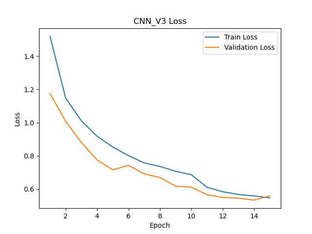

#### Confusion Matrix

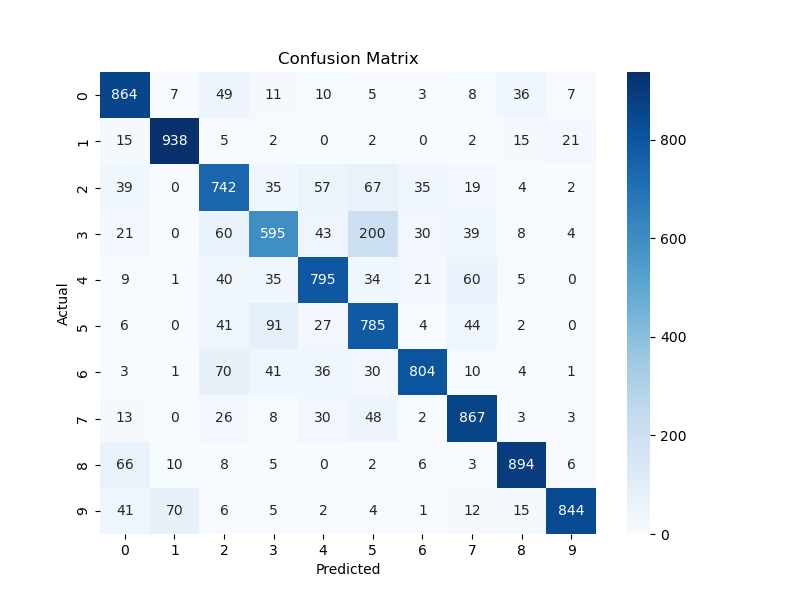

---

### CNN v2

#### Accuracy Curve

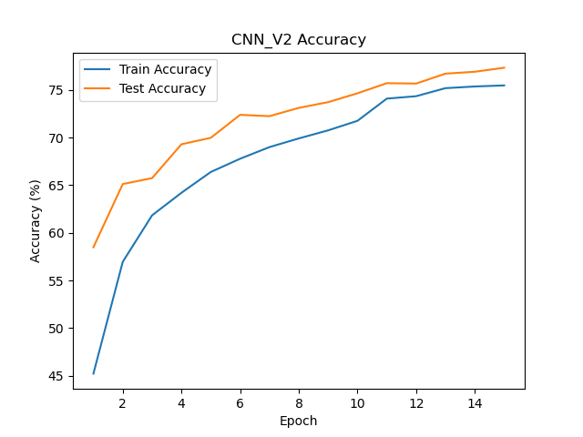

#### Loss Curve

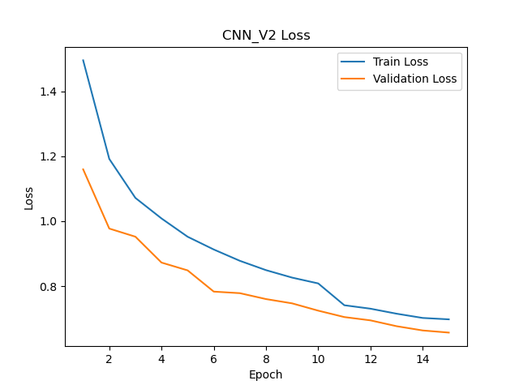

#### Confusion Matrix

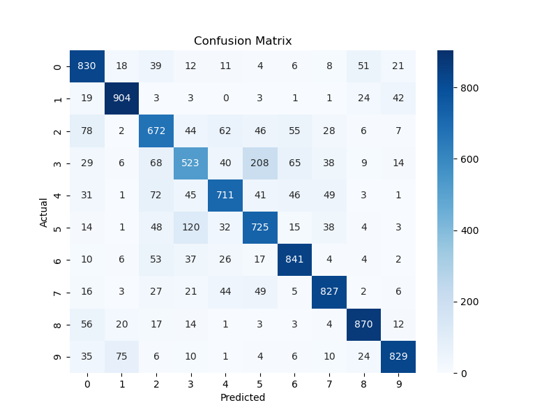

---

### CNN v1

#### Accuracy Curve

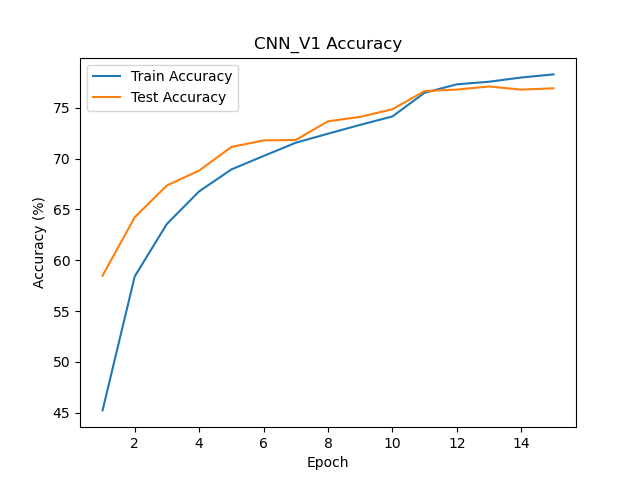

#### Loss Curve

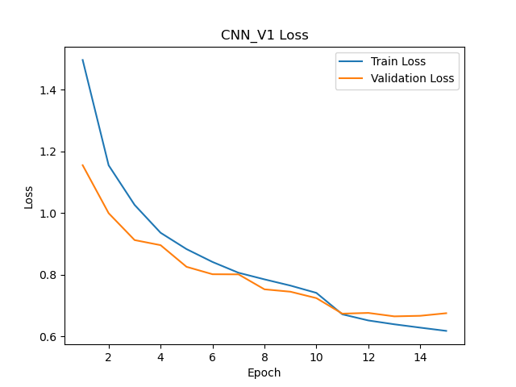

#### Confusion Matrix

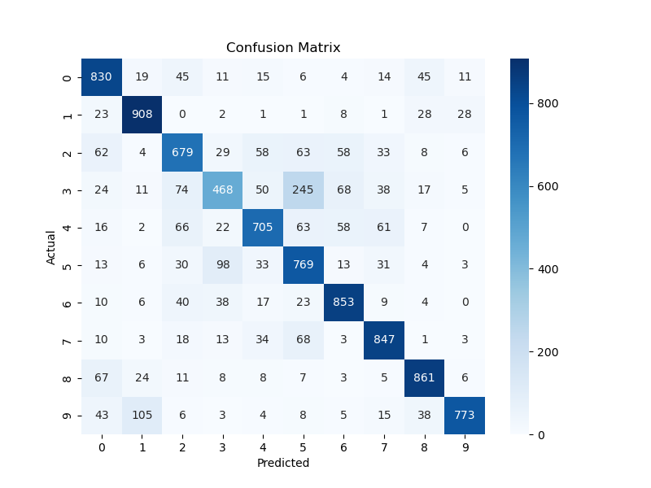

---

### MLP (Baseline)

#### Accuracy Curve

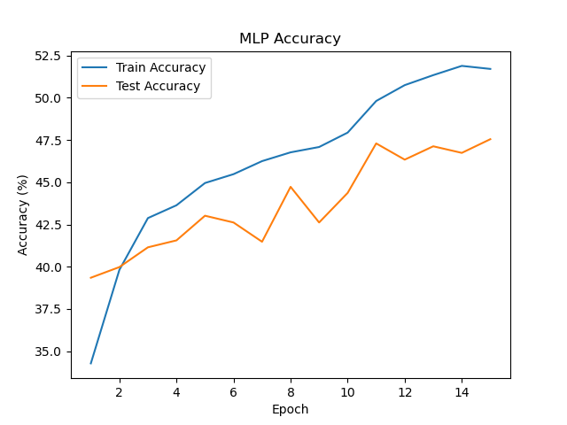

#### Loss Curve

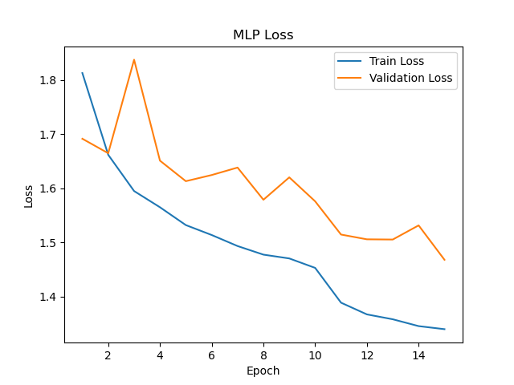

#### Confusion Matrix

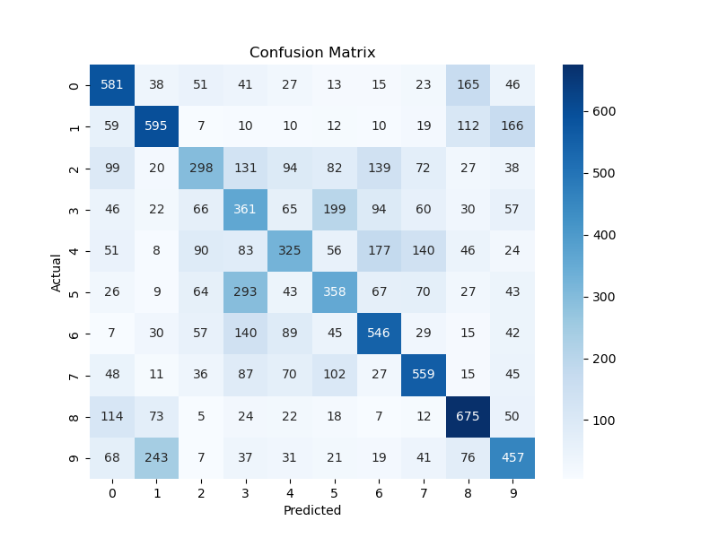

## Why CNN Outperforms MLP

CNNs leverage spatial locality using convolutional filters, enabling them to capture:

* Low-level features (edges, textures)
* Mid-level features (patterns, shapes)
* High-level representations

MLPs lose this information by flattening images, leading to weaker feature learning.

This results in:

* Better feature extraction
* Improved generalization
* Higher accuracy

---

## Training Features

* CrossEntropyLoss
* Adam optimizer
* Learning rate scheduling (StepLR)
* Validation-based checkpointing
* Accuracy and loss tracking
* Confusion matrix evaluation
* TensorBoard logging
* Reproducible seed setup

---

## Reproducibility

* Fixed random seeds
* Deterministic training setup
* Config-driven experiments

---

## How to Run

### Install dependencies

```
pip install -r requirements.txt
```

### Train a model

```
python -m image_classification_cnn.main --model cnn_v3
```

### Run TensorBoard

```
tensorboard --logdir runs
```

---

## Tech Stack

* Python
* PyTorch
* Torchvision
* NumPy
* Matplotlib
* TensorBoard

---

## Key Learnings

* Importance of spatial feature extraction
* Impact of model depth on performance
* Role of Batch Normalization and Dropout
* Designing modular ML pipelines

---

## Future Improvements

* Implement ResNet / EfficientNet
* Add data augmentation
* Hyperparameter tuning
* Mixed precision training
* FastAPI deployment
* Docker containerization

---

## Additional Notes

* Dataset is downloaded automatically and not included in the repository
* Large files (datasets, checkpoints, logs) are excluded via `.gitignore`

---

## Author

Dhayanitha H
GitHub: https://github.com/Dhayanitha
